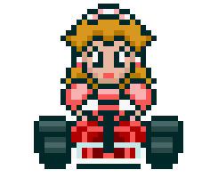
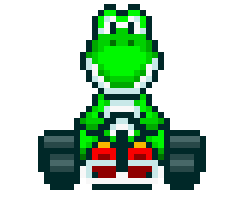
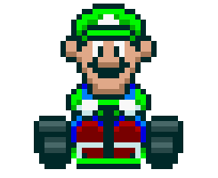
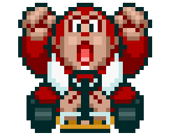

# 🏁 Desafio de Projeto: Mario Kart.JS

<table>
  <tr>
    <td>
      
    </td>
    <td>
      <b>Objetivo:</b>
      <p>Mario Kart é uma série de jogos de corrida desenvolvida e publicada pela Nintendo. Este projeto consiste em criar uma lógica de jogo em <b>Node.js</b> para simular corridas de Mario Kart, levando em consideração regras de velocidade, manobrabilidade e poder.</p>
    </td>
  </tr>
</table>

## 🏎️ Players Disponíveis

| Personagem | Imagem | Velocidade | Manobrabilidade | Poder |
| :---: | :---: | :---: | :---: | :---: |
| **Mario** |  | 4 | 3 | 3 |
| **Peach** |  | 3 | 4 | 2 |
| **Yoshi** |  | 2 | 4 | 3 |
| **Bowser** |  | 5 | 2 | 5 |
| **Luigi** |  | 3 | 4 | 4 |
| **D. Kong** |  | 2 | 2 | 5 |

## 🕹️ Regras de Negócio

1. **Jogadores:** O usuário escolhe um personagem e o computador escolhe um oponente aleatório.
2. **Pistas:** A corrida consiste em **5 rodadas**. A cada rodada, um bloco de pista é sorteado:
    * **RETA:** O jogador joga o dado + atributo `VELOCIDADE`.
    * **CURVA:** O jogador joga o dado + atributo `MANOBRABILIDADE`.
    * **CONFRONTO:** O jogador joga o dado + atributo `PODER`. Quem perder, perde um ponto (sem ficar negativo).
3. **Itens (Bônus):** Mecânica extra implementada!
    * 🍄 **Cogumelo:** +2 pontos na rodada.
    * 💣 **Bomba:** -2 pontos na rodada.
4. **Vitória:** Vence quem tiver mais pontos ao final das 5 rodadas.

## 🚀 Como Rodar o Projeto

### Pré-requisitos

* Node.js instalado.

### Passo a Passo

1. Clone o repositório:

    ```bash
    git clone https://github.com/CrisisUp/desafio-mario.git
    ```

2. Entre na pasta:

    ```bash
    cd desafio-mario
    ```

3. Execute o jogo:

    ```bash
    npm start
    ```

## 🛠️ Tecnologias Utilizadas

* **JavaScript (ES Modules)**
* **Node.js**
* **Shell/Terminal** para interação

---
*Projeto refatorado e modernizado com base no desafio da DIO do Felipe Aguiar.*
